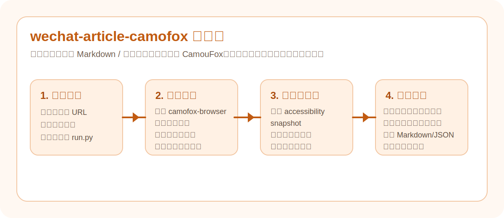
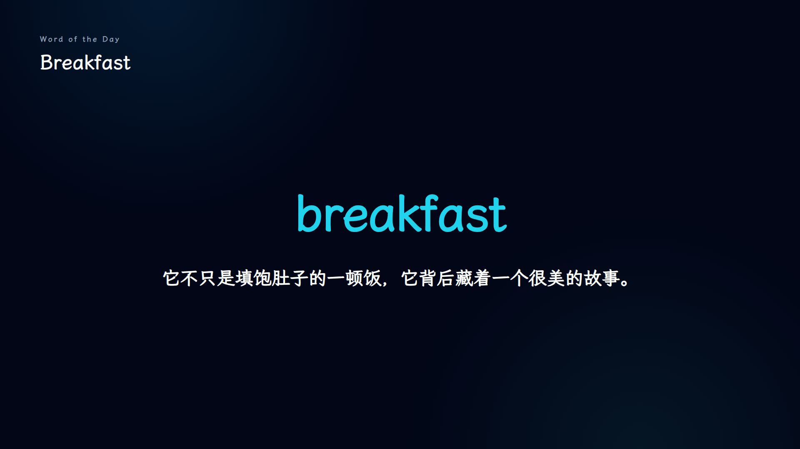
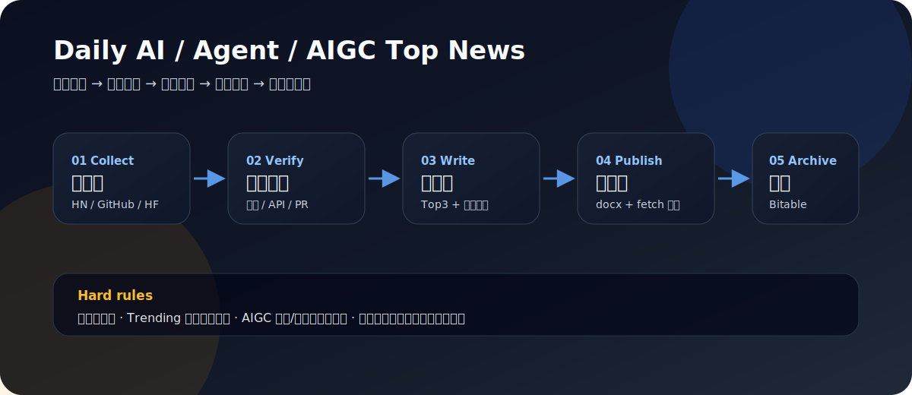
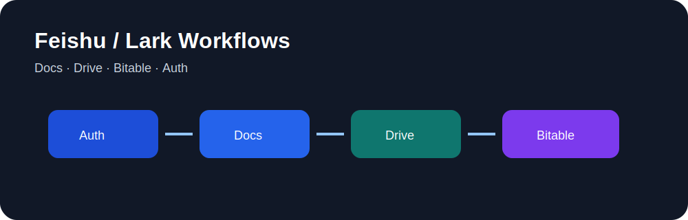
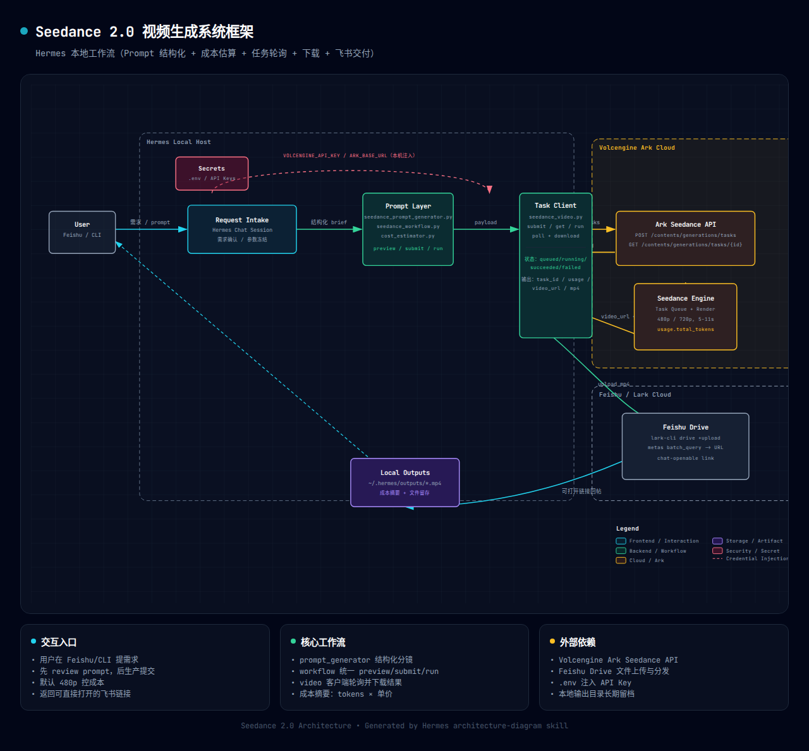
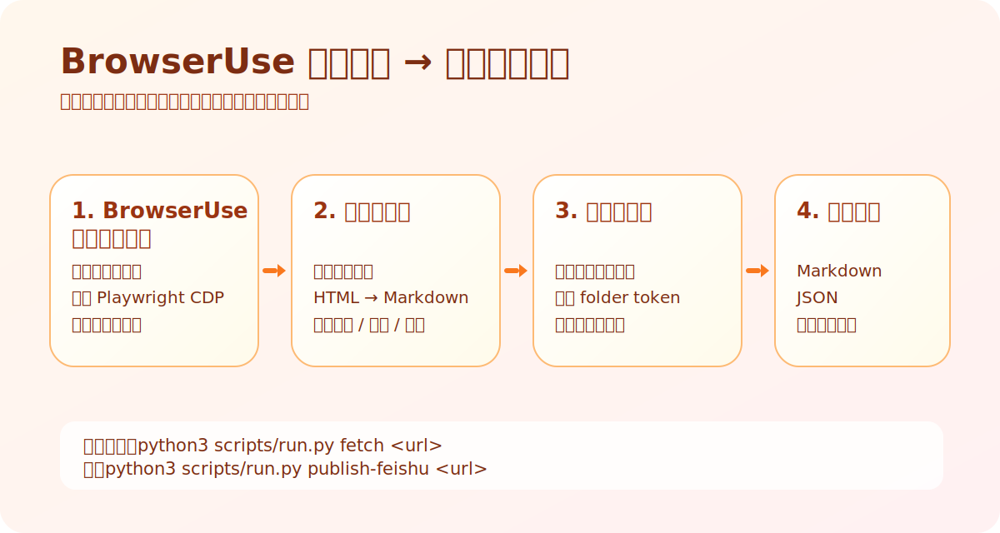

# Draco Skills Collection

一个面向内容生产、飞书协作、公众号发布、多媒体自动化和代码视频制作的工具仓库。

这里收的东西，目标都很直接：
- 能单独看懂
- 能尽快跑起来
- 能在真实工作流里省时间

如果你想要的是“讲一堆概念”，这仓库不合适。这里更像一排已经接好电的工具台。

## 仓库里有什么

目前主要包括这些目录：

| 目录 | 适合做什么 | 核心输出 |
|---|---|---|
| [`wechat-article-camofox/`](./wechat-article-camofox/) | 抓取微信公众号文章并清洗 | Markdown / JSON / 飞书文档 |
| [`wechat-article-browseruse/`](./wechat-article-browseruse/) | 用 BrowserUse 云浏览器抓公众号并发布飞书 | Markdown / JSON / 飞书文档 |
| [`nano-banana-image/`](./nano-banana-image/) | 用 Nano Banana 2 / Gemini Flash Image 直接出图 | 单图 / 批量图 / workflow |
| [`jimeng-image/`](./jimeng-image/) | 用即梦 / Doubao Seedream 出图 | 文生图 / 图生图 / 多参考图 |
| [`article-to-wechat-cover/`](./article-to-wechat-cover/) | 从文章自动生成公众号封面 | 横幅封面图 / 微信封面素材 |
| [`feishu-doc-to-wechat-draft/`](./feishu-doc-to-wechat-draft/) | 飞书文档转公众号草稿 | 微信草稿 / HTML 预览 |
| [`epub2podcast/`](./epub2podcast/) | 把 EPUB 做成双人中文播客视频 | 播客脚本 / 音频 / Slide / MP4 |
| [`video-framework-selector/`](./video-framework-selector/) | 视频任务开工前先做框架选型 | 推荐框架 / 选择理由 / 下一步建议 |
| [`manim-video/`](./manim-video/) | 做数学、公式、对象变换和算法过程解释视频 | 分镜 / `script.py` / MP4 |
| [`manim-video-with-tts/`](./manim-video-with-tts/) | **Manim + 火山 TTS**：制作带中文旁白的数学解释视频 | 分镜 / TTS / `script.py` / MP4 |
| [`hyperframes-explainer-video/`](./hyperframes-explainer-video/) | 用 HyperFrames 制作讲解/介绍类视频（HTML+GSAP+TTS 全链路） | 脚本 / TTS / HTML / MP4 |
| [`motion-canvas/`](./motion-canvas/) | 做 TS 场景动画、时间轴讲解和 motion graphics | 场景代码 / 模板 / 视频项目 |
| [`remotion/`](./remotion/) | 做 React 页面型视频、模板化视频和批量视频 | Composition / still 图 / MP4 |
| [`vocabulary-video-pipeline/`](./vocabulary-video-pipeline/) | 做面向中小学生的英文单词解释视频（Remotion 流水线） | 草稿 JSON / TTS / Beats / MP4 |
| [`seedance-video-local/`](./seedance-video-local/) | 用火山引擎 Seedance 2.0 生成短视频 | 任务ID / 成本估算 / MP4 |
| [`daily-ai-agent-aigc-top-news/`](./daily-ai-agent-aigc-top-news/) | 每天生成 AI / Agent / AIGC 早报并发布到飞书 | 飞书文档 / 多维表归档 / 摘要回传 |
| [`news-aggregator-skill/`](./news-aggregator-skill/) | 抓取 AI / 技术新闻候选线索 | JSON 候选池 / 趋势信号 |
| [`ai-news-bitable-archive/`](./ai-news-bitable-archive/) | 把飞书日报归档到多维表 | record_id / 可检索归档 |
| [`feishu-lark-workflows/`](./feishu-lark-workflows/) | 飞书文档、云盘、多维表自动化路线 | Docs / Drive / Bitable 操作指南 |
| [`feishu-bitable-video-baseline-completion/`](./feishu-bitable-video-baseline-completion/) | 补全已验收视频的多维表基线记录 | 资产链路 / Prompt / 附件 / QA 映射 |

---

## 首页预览

<table>
  <tr>
    <td width="50%" valign="top">
      <a href="./wechat-article-camofox/README.md">
        
      </a>
      <p><strong>wechat-article-camofox</strong><br/>把公众号文章抓成更干净的 Markdown / JSON，或者直接发布成飞书文档。</p>
    </td>
    <td width="50%" valign="top">
      <a href="./nano-banana-image/README.md">
        
      </a>
      <p><strong>nano-banana-image</strong><br/>直接用 Nano Banana 2 / Gemini Flash Image 出图，适合头图、横幅图、海报和批量视觉实验。</p>
    </td>
  </tr>
  <tr>
    <td width="50%" valign="top">
      <a href="./jimeng-image/README.md">
        
      </a>
      <p><strong>jimeng-image</strong><br/>走火山引擎 Ark 上的即梦 / Doubao Seedream，适合更省钱的文生图、图生图和多参考图任务。</p>
    </td>
    <td width="50%" valign="top">
      <a href="./article-to-wechat-cover/README.md">
        
      </a>
      <p><strong>article-to-wechat-cover</strong><br/>先理解文章主题，再自动生成适合公众号的横幅封面。</p>
    </td>
  </tr>
  <tr>
    <td width="50%" valign="top">
      <a href="./epub2podcast/README.md">
        
      </a>
      <p><strong>epub2podcast</strong><br/>把电子书转成双人中文播客脚本、音频、Slides 和最终视频。</p>
    </td>
    <td width="50%" valign="top">
      <a href="./vocabulary-video-pipeline/README.md">
        
      </a>
      <p><strong>vocabulary-video-pipeline</strong><br/>一键生成面向中小学生的英文单词解释视频，含 TTS、节拍同步和自动上传。</p>
    </td>
  </tr>
  <tr>
    <td width="50%" valign="top">
      <p><strong>feishu-doc-to-wechat-draft</strong><br/>把飞书文档转成公众号草稿，处理图片、样式和预览，适合真正临门一脚的发布环节。</p>
      <p>详情见：<a href="./feishu-doc-to-wechat-draft/README.md">feishu-doc-to-wechat-draft/README.md</a></p>
    </td>
    <td width="50%" valign="top">
      <a href="./daily-ai-agent-aigc-top-news/README.md">
        
      </a>
      <p><strong>daily-ai-agent-aigc-top-news</strong><br/>每天自动生成 AI / Agent / AIGC 早报，发布飞书文档并归档到多维表。</p>
    </td>
  </tr>
  <tr>
    <td width="50%" valign="top">
      <a href="./feishu-lark-workflows/README.md">
        
      </a>
      <p><strong>feishu-lark-workflows</strong><br/>飞书文档、云盘、多维表自动化路线，适合先把平台动作走稳。</p>
    </td>
    <td width="50%" valign="top">
      <a href="./feishu-bitable-video-baseline-completion/README.md">
        
      </a>
      <p><strong>feishu-bitable-video-baseline-completion</strong><br/>把已验收视频行补成完整 baseline：资产链路、Prompt、附件、QA 和成本都能回看。</p>
    </td>
  </tr>
</table>

### Seedance 2.0 预览



---

## 按场景选工具

### 1）你每天追 AI / Agent / AIGC
优先看：
- [`daily-ai-agent-aigc-top-news`](./daily-ai-agent-aigc-top-news/)：早报总入口
- [`news-aggregator-skill`](./news-aggregator-skill/)：候选抓取
- [`feishu-lark-workflows`](./feishu-lark-workflows/)：飞书发布/回读
- [`ai-news-bitable-archive`](./ai-news-bitable-archive/)：多维表归档

它适合做每天固定时间的 AI 早报：抓候选、核验来源、写中文摘要、发布飞书文档，再归档到多维表。

### 2）你主要做公众号内容
推荐这条链路：

1. 抓文章时二选一：
   - 偏本机浏览器稳定链路：[`wechat-article-camofox`](./wechat-article-camofox/)
   - 想走 BrowserUse 云浏览器：[`wechat-article-browseruse`](./wechat-article-browseruse/)
2. 需要封面时：
   - 想直接写 prompt 出图，用 [`nano-banana-image`](./nano-banana-image/)
   - 想走更省钱路线，用 [`jimeng-image`](./jimeng-image/)
   - 想让系统先理解文章，再出封面，用 [`article-to-wechat-cover`](./article-to-wechat-cover/)
3. 最后用 [`feishu-doc-to-wechat-draft`](./feishu-doc-to-wechat-draft/) 发到公众号草稿箱

### BrowserUse 版抓取器预览



快速开始：

```bash
cd wechat-article-browseruse
python3 -m venv .venv && source .venv/bin/activate
pip install -r requirements.txt
playwright install chromium

# 抓取公众号文章
python3 scripts/run.py fetch \
  "https://mp.weixin.qq.com/s/xxxxxxxxxxxxxxxx"

# 发布到飞书原生文档
python3 scripts/run.py publish-feishu \
  "https://mp.weixin.qq.com/s/xxxxxxxxxxxxxxxx"
```

更多详情查看 [`wechat-article-browseruse/README.md`](./wechat-article-browseruse/README.md)

### 3）你主要做批量视觉实验
优先看：
- [`nano-banana-image`](./nano-banana-image/)
- [`jimeng-image`](./jimeng-image/)

它们都支持：
- 单张模式
- 批量模式
- workflow 模式

区别很简单：
- `nano-banana-image`：更适合高质量营销视觉和结构化 JSON prompt 控制
- `jimeng-image`：更适合火山引擎路线，支持图生图、多参考图和连续组图

### 4）你主要做长内容再加工
优先看：
- [`epub2podcast`](./epub2podcast/)

它更适合把书、长文、系列内容变成更容易传播的播客视频。

### 5）你主要做视频 / 动画
推荐这样走：

1. 先用 [`video-framework-selector`](./video-framework-selector/) 判断这次该选哪条路线
2. 如果重点是数学、公式、对象变换、算法过程：看 [`manim-video`](./manim-video/)
3. 如果需要中文旁白/语音同步：看 [`manim-video-with-tts`](./manim-video-with-tts/)
4. 如果重点是 TS 场景动画、时间轴编排、讲解型 motion graphics：看 [`motion-canvas`](./motion-canvas/)
4. 如果重点是 React 页面、组件、卡片、模板化批量视频：看 [`remotion`](./remotion/)
5. 如果重点是英文单词解释视频（带 TTS 同步）：看 [`vocabulary-video-pipeline`](./vocabulary-video-pipeline/)
6. 如果重点是"参考首帧 + 分镜 + 成本可控"的 Seedance 成片链路：看 [`seedance-video-local`](./seedance-video-local/)
7. 如果重点是用 HTML+GSAP+Canvas 做讲解/介绍类视频（音频驱动、组件库编排）：看 [`hyperframes-explainer-video`](./hyperframes-explainer-video/)

一句话判断：
- **对象怎么变** → `manim-video`
- **数学视频 + 中文旁白** → `manim-video-with-tts`
- **场景怎么演** → `motion-canvas`
- **页面这一帧长什么样** → `remotion`
- **英文单词视频流水线** → `vocabulary-video-pipeline`
- **讲解视频全链路（HTML+GSAP+TTS）** → `hyperframes-explainer-video`

---

## 每个目录的使用方式

这仓库不是一个“大一统 monorepo 应用”。

更准确地说：
- 每个目录是一个相对独立的小工具 / 小工作流
- 各自有自己的 README、脚本入口和依赖说明
- 用哪个，就进哪个目录看 README

常见启动方式通常长这样：

```bash
cd <project-dir>
python3 scripts/run.py --help
```

---

## 通常会用到的基础依赖

不同目录依赖不同，但常见基础环境包括：

- Python 3
- `git`
- Node.js / `npm`
- `lark-cli`
- 对应项目需要的 API key 或服务配置

有些项目更偏本地自动化，有些更偏 API 编排。别偷懒，先看对应目录 README。

---

## 从哪里开始

如果你是第一次进这个仓库，我建议按这个顺序看：

- 想看每日 AI / Agent / AIGC 早报：[`daily-ai-agent-aigc-top-news`](./daily-ai-agent-aigc-top-news/)
- 想单独抓新闻候选：[`news-aggregator-skill`](./news-aggregator-skill/)
- 想把日报写入多维表：[`ai-news-bitable-archive`](./ai-news-bitable-archive/)
- 想做飞书文档/多维表自动化：[`feishu-lark-workflows`](./feishu-lark-workflows/)
- 想抓内容：[`wechat-article-camofox`](./wechat-article-camofox/)
- 想直接出图：[`nano-banana-image`](./nano-banana-image/)
- 想试火山即梦：[`jimeng-image`](./jimeng-image/)
- 想自动做公众号封面：[`article-to-wechat-cover`](./article-to-wechat-cover/)
- 想发公众号草稿：[`feishu-doc-to-wechat-draft`](./feishu-doc-to-wechat-draft/)
- 想做长内容播客视频：[`epub2podcast`](./epub2podcast/)
- 想做英文单词解释视频：[`vocabulary-video-pipeline`](./vocabulary-video-pipeline/)
- 想先判断视频框架：[`video-framework-selector`](./video-framework-selector/)
- 想做数学 / 对象变换视频：[`manim-video`](./manim-video/)
- 想做数学视频 + 中文旁白同步：[`manim-video-with-tts`](./manim-video-with-tts/)
- 想做 TS 场景动画：[`motion-canvas`](./motion-canvas/)
- 想做 React 页面型视频：[`remotion`](./remotion/)
- 想用 HyperFrames 做讲解/介绍类视频：[`hyperframes-explainer-video`](./hyperframes-explainer-video/)
- 想用 Seedance 生成短视频：[`seedance-video-local`](./seedance-video-local/)

---

## 一句话总结

**如果你想把“抓内容、出图、做封面、发公众号、做播客、做代码视频”这些动作逐步自动化，这个仓库就是一组能直接上手、也能继续扩展的实用工具。**
