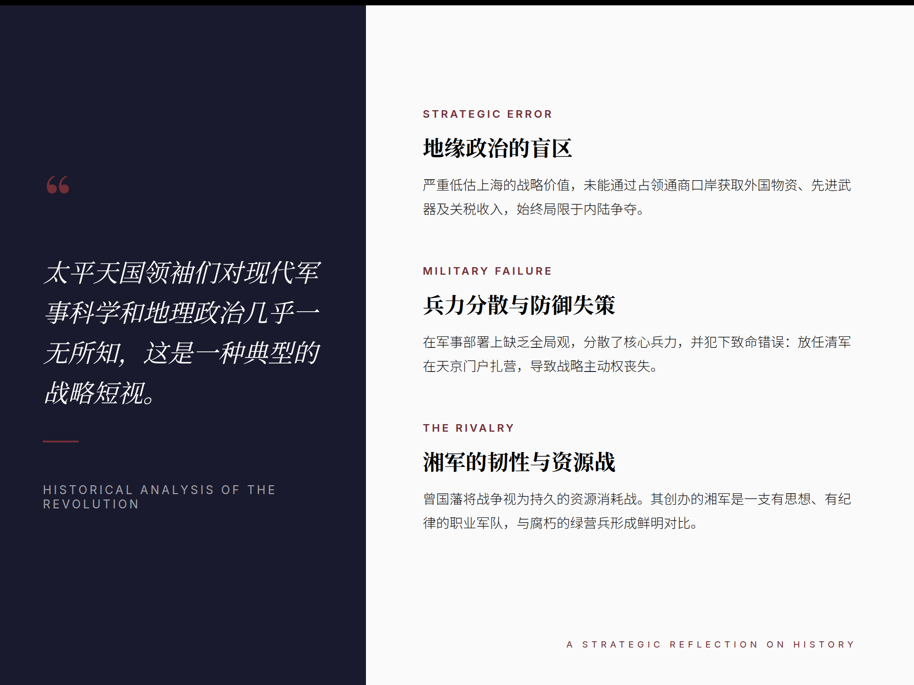
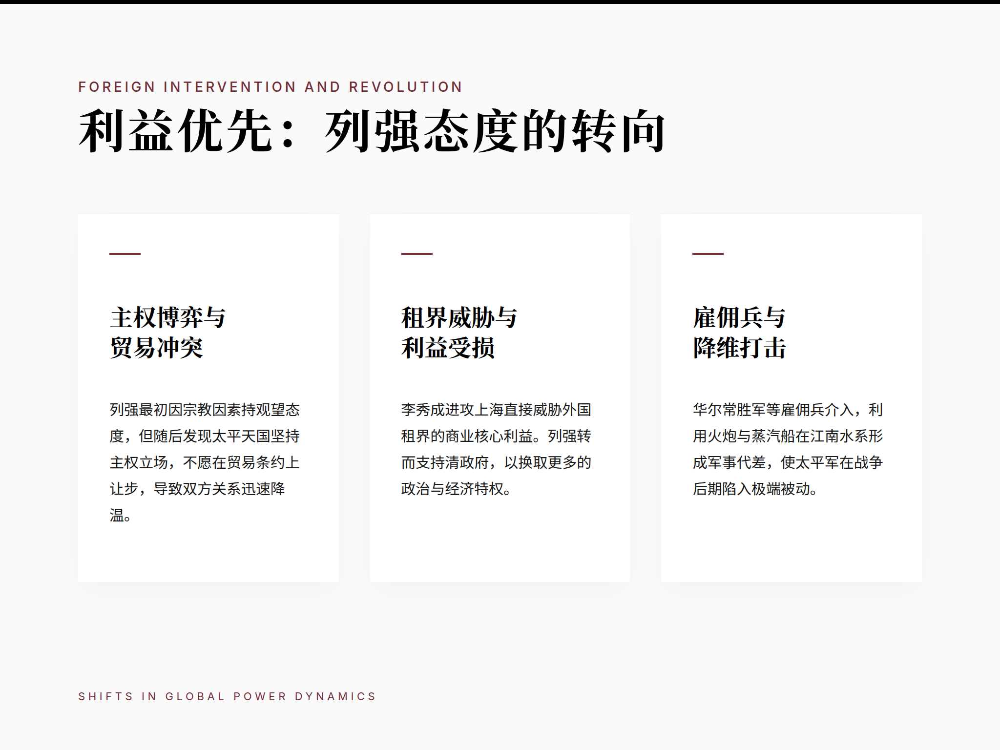

# Draco Skills Collection

这是一个用来收集和整理 Draco使用 **Hermes Agent** 封装的skills的公开仓库。

## 这个仓库里有什么

目前已经收录：

### `epub2podcast/`

这是当前仓库中的 podcast skill / 项目，主要覆盖电子书到视频播客的完整工作流，包括：

- 在飞书中将电子书EPUB文件上传给 Hermes Agent
- 把 EPUB 转成双人中文播客脚本
- 生成分段音频，并合成完整音频
- 生成 Smart Slide
- 合成最终 MP4 视频
- 提供视频压缩脚本，方便后续分享或上传

当前已经完成真实端到端验证，可独立安装、构建和运行。

发布状态：**v0.1.0 early standalone release**

示例页面预览：

### 示例 1：封面页风格

这类页面适合放在视频开头，用来介绍书名、主题和整体气质。

### 示例 2：信息图风格

这类页面适合在视频中段解释观点、拆解结构，或者展示一个主题的关键信息。

### 示例 3：左右分栏版式

这类页面适合做“引言 + 分点展开”的讲述页。

### 示例 4：三卡片版式

这类页面适合把一个主题拆成多个并列重点。

更多截图、流程图和说明，请查看：
- [`epub2podcast/README.md`](./epub2podcast/README.md)

目录里目前包含：

- `SKILL.md`：核心技能说明
- `README.md`：面向普通读者的介绍
- `scripts/epub2podcast_local_run.sh`：主运行脚本
- `scripts/epub2podcast_local_regenerate_slide.sh`：重生成单页 slide
- `scripts/epub2podcast_local_compress_feishu_video.sh`：压缩视频文件

