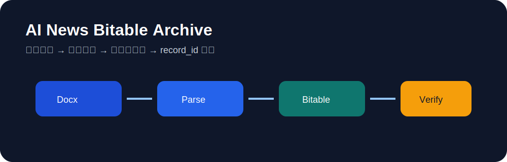

# ai-news-bitable-archive-dingtalk

把钉钉日报文档解析后，写入钉钉多维表。**钉钉专用版**。

它适合接在 `daily-ai-agent-aigc-top-news-dingtalk` 后面：日报先发成钉钉文档，然后把标题、Top3、摘要、文档链接等字段同步到多维表。



## 快速开始

```bash
cd ai-news-bitable-archive-dingtalk
python3 scripts/sync_doc_to_dingtable.py \
  --doc-url 'https://alidocs.dingtalk.com/i/nodes/<NODE_ID>' \
  --base-id '<DINGTALK_BASE_ID>' \
  --table-id '<DINGTALK_TABLE_ID>' \
  --date 'YYYY-MM-DD' \
  --status '已归档'
```

## 需要什么

- `python3`
- `dws` CLI（钉钉命令行工具）
- 已登录钉钉
- 多维表 `base_id`
- 多维表 `table_id`

## 会写哪些字段

| 字段 | 来源 |
|---|---|
| 标题 | 文档标题 |
| 日期 | 参数或标题日期 |
| 文档链接 | `doc_url` |
| 文档Token | 文档 nodeId |
| 统计窗口 | 文档正文 |
| Top1/Top2/Top3 | `## 最值得注意的 3 条` |
| 一句话结论 | `## 一句话结论` |
| 摘要 | Top3 拼接 |
| 状态 | 参数 |

## 注意

钉钉多维表的 URL 字段直接传字符串即可，无需 `{link, text}` 对象格式。脚本已处理。
