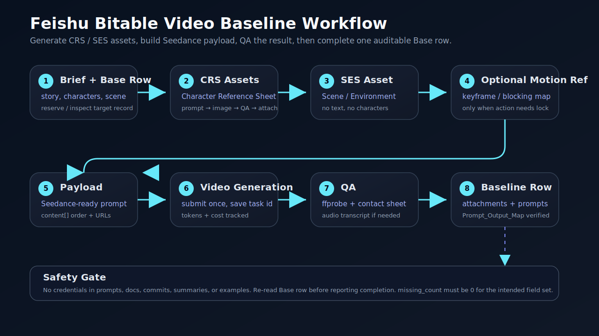

# feishu-bitable-video-baseline-completion

把 AI 视频从 Brief 做到飞书多维表 baseline：生成角色参考图、场景参考图、视频 payload、成片 QA，再把资产链路完整回填到一条可复盘记录。

它现在覆盖两种模式：

1. **端到端生产**：从 Brief → Character Reference Sheet → Scene, Environment, and Settings reference image → Seedance payload → 视频 → QA → 多维表归档。
2. **历史补全**：视频已合格，但多维表行缺工具、Prompt、附件、URL、成本、QA、`Prompt_Output_Map`。



## 适合做什么

| 场景 | 动作 |
|---|---|
| 要做一条可复盘的视频 baseline | 生成 CRS / SES / payload / 视频 / QA / 表格归档 |
| 已有视频版本被验收 | 回填资产链路和 `Prompt_Output_Map` |
| 缺角色参考图 Prompt 模板 | 使用固化的 Character Reference Sheet 模板 |
| 缺场景环境图 Prompt 模板 | 使用固化的 Scene, Environment, and Settings reference image 模板 |
| 缺视频生成记录 | 保存 prompt、payload、任务ID、seed、tokens、成本 |
| 需要防止凭据泄漏 | 推送前做敏感信息扫描 |

## 核心流程

```text
Brief
→ Character Reference Sheet prompts
→ Character Reference Sheet images + QA
→ Scene, Environment, and Settings reference image prompt
→ Scene reference image + QA
→ optional action / blocking reference
→ Seedance-ready prompt + payload
→ video generation
→ ffprobe / contact sheet / audio QA
→ Base row attachments + text fields
→ Prompt_Output_Map
→ record-get verification
```

## 内置模板

`SKILL.md` 已固化三类模板：

- **Character Reference Sheet**：4:3 横版 Master Character Reference Sheet，含多视图、表情、头部细节、姿态、道具、手势/爪势。
- **Scene, Environment, and Settings reference image**：16:9 单张电影感环境参考图，默认无角色、无文字、无标签、无面板。
- **Seedance-ready video prompt**：按 `REFERENCE USAGE / CHARACTERS / SETTING / TIMELINE / CAMERA / AUDIO / RESTRICTIONS` 组织，避免 `@Image1` 和未解释缩写。

## 典型多维表字段

```text
角色参考图（CRS）_角色1_工具
角色参考图（CRS）_角色1_Prompt
输入资产_角色1参考图
角色1参考图_URL

场景环境设定参考图（SES）_工具
场景环境设定参考图（SES）_Prompt
输入资产_场景环境设定参考图
场景环境设定参考图_URL

视频生成_Prompt
视频生成 Payload文件
Prompt文件
Reference_URLs
Prompt_Output_Map
生成视频成片
质量检查抽帧图
QA摘要
视频生成_TaskID
视频生成_Seed
视频生成_Tokens
视频生成_估算成本CNY
```

## 关键原则

- 一条合格视频 = 一条可审计 baseline 记录
- 生成资产时就入表，不等最后补救
- 附件给人看，公网 URL 给 API 复现
- Prompt 和资产来源必须能追溯
- 视频生成前必须获得用户确认，避免误烧成本
- 不把 token、table id、API key、签名 URL 写进公开仓库
- 更新后必须 `record-get` 回读验证

## 最小使用方式

把 `SKILL.md` 放到支持 Agent Skills 的环境中。遇到“飞书多维表管理视频 baseline”的任务时加载此 skill。

```text
Use when producing, approving, or repairing a Feishu/Lark Base video baseline row end-to-end.
```

## 常见坑

- 不要把这个 skill 当纯补表器；它现在覆盖 CRS / SES / payload / QA / 归档
- 飞书附件上传不要传绝对路径，先 `cd` 再传相对文件名
- `record-list` 可能看不到长字段完整内容，验证用 `record-get`
- `record-batch-update` 要用 `record_id_list + patch` 结构
- 不能只凭记忆补资产，要看 payload、Reference_URLs 和 hash
- 推 Git 前先扫敏感凭据
