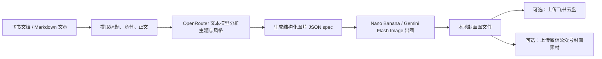

# 文章自动生成微信公众号封面图

把一篇飞书文档或本地 Markdown 文章，自动变成一张适合微信公众号使用的横幅封面图。

这个工具会先理解文章主题、语气和视觉风格，再调用 OpenRouter 上的 Nano Banana / Gemini Flash Image 模型生成图片，而不是让你手写一大段 prompt。

## 适合谁用

- 经常把飞书文档发布到微信公众号的人
- 希望封面图能跟文章内容自动匹配的人
- 想把“文章理解 + 封面图生成 + 微信封面素材上传”串起来的人

## 亮点

- **固定 2.35:1 横幅比例**，适合公众号封面图
- **主题自动提炼**，封面内容围绕文章核心观点生成
- **风格自动匹配**，会根据文章语气推断更适合的视觉表达
- **支持飞书文档和本地 Markdown 两种输入**
- **可直接上传为微信公众号封面素材**，拿到 `thumb_media_id`
- **可导出分析 JSON 和图片 JSON spec**，方便审查和复用

## 效果示例

下面这张图，就是用一篇关于 AI Agent 产品化的文章自动生成的公众号封面：


## 它会做什么

整个流程可以理解为：



## 前置要求

### 1）基础环境

- Python 3.9+
- 可访问 OpenRouter

### 2）OpenRouter 环境变量

至少需要：

```bash
OPENROUTER_API_KEY=你的key
```

可选：

```bash
OPENROUTER_TEXT=google/gemini-2.5-flash
OPENROUTER_IMAGE=google/gemini-3.1-flash-image-preview
```

### 3）如果你要读取飞书文档

需要本机已经安装并登录 `lark-cli`。

### 4）如果你要直接上传到微信公众号封面素材库

需要：

```bash
WECHAT_APP_ID=你的公众号AppID
WECHAT_APP_SECRET=你的公众号AppSecret
```

并确保服务器 IP 已加入公众号后台白名单。

## 安装

```bash
git clone https://github.com/dracohu2025-cloud/draco-skills-collection.git
cd draco-skills-collection/article-to-wechat-cover
```

如果你的环境已经有 Python 和依赖管理工具，可以按自己的方式安装；当前仓库附带：

```bash
pip install -r requirements.txt
```

## 快速开始

### 1）从本地 Markdown 生成封面

```bash
python3 scripts/run.py from-markdown \
  --input ./article.md \
  --output ./wechat-cover.jpg
```

### 2）从飞书文档生成封面

```bash
python3 scripts/run.py from-feishu-doc \
  --doc "https://your-domain.feishu.cn/docx/DocID" \
  --output ./wechat-cover.jpg
```

### 3）导出分析结果，方便检查主题是否抓对

```bash
python3 scripts/run.py from-markdown \
  --input ./article.md \
  --analysis-json /tmp/cover-analysis.json \
  --dump-json-spec /tmp/cover-spec.json \
  --output ./wechat-cover.jpg
```

### 4）直接上传成微信公众号封面素材

```bash
python3 scripts/run.py from-feishu-doc \
  --doc "https://your-domain.feishu.cn/docx/DocID" \
  --upload-wechat-cover
```

成功后会返回：

```bash
thumb_media_id=xxxx
```

## 常用参数

| 参数 | 说明 |
|---|---|
| `--output` | 输出图片路径 |
| `--analysis-json` | 导出文章主题分析 JSON |
| `--dump-json-spec` | 导出最终图片生成 spec |
| `--visual-style-hint` | 人工补充视觉偏好 |
| `--must-include` | 强制要求出现的视觉元素，逗号分隔 |
| `--must-avoid` | 强制避免的视觉元素，逗号分隔 |
| `--allow-text-overlay` | 允许少量文字出现在封面中 |
| `--upload-feishu` | 生成后上传飞书云盘 |
| `--upload-wechat-cover` | 生成后上传微信封面素材库 |

## 推荐用法

如果你已经有“飞书文档 -> 微信草稿箱”的流程，推荐这样串起来：

1. 先用本工具生成封面并拿到 `thumb_media_id`
2. 再把这个 `thumb_media_id` 传给文章发布工具

例如：

```bash
python3 scripts/run.py from-feishu-doc \
  --doc "https://your-domain.feishu.cn/docx/DocID" \
  --upload-wechat-cover
```

然后：

```bash
python3 ../feishu-doc-to-wechat-draft/scripts/run.py publish-feishu-doc-default \
  --doc "https://your-domain.feishu.cn/docx/DocID" \
  --thumb-media-id "上一步返回的media_id"
```

## 输出说明

正常执行后，你会拿到这些信息：

- `output=...`：本地图片路径
- `mime_type=...`：实际返回图片类型
- `aspect_ratio=2.35:1`
- `core_theme=...`：模型提炼出的核心主题
- `visual_direction=...`：建议的主视觉方向
- `thumb_media_id=...`：如果启用了微信封面上传

## 文件结构

```text
article-to-wechat-cover/
├── README.md
├── SKILL.md
├── .env.example
├── requirements.txt
├── scripts/
│   ├── run.py
│   └── article_to_wechat_cover.py
├── tests/
│   └── test_article_to_wechat_cover.py
└── assets/
    └── example-wechat-cover.jpg
```

## 常见问题

### 1）为什么生成的图片没有文字？

默认策略是尽量避免把封面做成廉价海报，所以默认不加文字。如果你希望加少量标题字，可加：

```bash
--allow-text-overlay
```

### 2）为什么输出文件后缀被自动改了？

因为图片模型有时返回的是 JPEG。如果你手动写了 `.png`，脚本会自动修正成正确后缀，避免文件内容和扩展名不一致。

### 3）它是不是直接读取整篇文章原文逐字出图？

不是。它会先提炼主题和视觉 brief，再生成结构化图片 spec，这样更稳定，也更适合公众号封面。

## 适用边界

更适合：

- 技术文章
- AI / 产品 / 方法论类文章
- 观点分析
- 总结型内容

不太适合：

- 强品牌广告主视觉
- 需要精确排版大段文字的海报
- 活动 KV

这类场景建议再补充人工 art direction。
