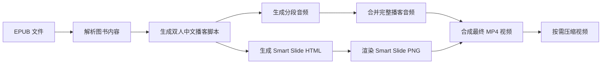

# epub2podcast

`epub2podcast` 现在已经升级成一个 **可独立运行的本地项目**。

这意味着：

- 你**不需要**再另外准备原始 `epub2podcast-local` 项目代码
- 只需要下载当前这个目录
- 安装依赖、配置环境变量后
- 就可以从电子书一路生成脚本、音频、Smart Slide 和最终视频

一句话理解：

> 这是一个把 EPUB 内容整理成“可听、可看、可分享”的播客项目。

---

## 现在它能做什么

当前这版独立项目主要覆盖这条本地链路：

1. 读取 **EPUB** 文件
2. 生成双人中文播客脚本
3. 生成分段音频
4. 合并为完整播客音频
5. 生成 Smart Slide HTML 与 PNG
6. 合成最终 MP4 视频
7. 按需要压缩视频，方便后续上传或分享

## 亮点摘要

- **独立运行**：不再依赖原来的 `epub2podcast-local` 项目目录
- **本地优先**：核心处理流程在本地完成，更容易掌控产物
- **端到端**：从电子书到脚本、音频、Slide、视频，一条链路跑完
- **可复用**：支持主流程、单页重生成、视频压缩三种常用入口
- **适合展示**：很适合做图书播客、知识型视频播客和内容再包装

## 适合什么场景

这个项目适合下面这些场景：

- 你想把一本书快速整理成“可以听”的播客内容
- 你想把一本书进一步做成“可以看”的视频播客
- 你想在本地掌控脚本、音频、页面和视频的完整产出
- 你想把这条工作流沉淀成一个长期可复用的项目

---

## 示例效果

### 示例 1：封面页风格


这类页面适合做视频开场、书籍介绍或主题引入。

### 示例 2：信息页风格


这类页面适合在视频中段解释观点、拆解结构，或者展示一个主题的关键信息。

---

## 工作流程图



---

## 安装前需要准备什么

虽然它已经是独立项目，但仍然需要本机具备基础运行环境。

### 系统依赖

请先确认本机已经安装：

- Node.js 20+
- npm
- `ffmpeg`
- `ffprobe`
- Chrome 或 Chromium

### 模型 / TTS 环境变量

你还需要准备模型和 TTS 所需的环境变量。当前最常见的是：

- `OPENROUTER_API_KEY`
- `VOLCENGINE_ACCESS_TOKEN`
- `VOLCENGINE_APP_ID`
- `VOLCENGINE_VOICE_ID_MALE`
- `VOLCENGINE_VOICE_ID_FEMALE`

项目中已经附带：

- `.env.example`

你可以复制它来开始配置。

---

## 3 分钟快速开始

### 1）进入目录并安装依赖

```bash
cd epub2podcast
npm install
```

### 2）复制环境变量模板

```bash
cp .env.example .env
```

然后按你的实际账号与服务配置补全 `.env`。

### 3）构建项目

```bash
npm run build
```

### 4）运行主流程

```bash
node dist/cli/run.js --epub ./book.epub --output-dir ./deliveries
```

或者使用脚本入口：

```bash
bash scripts/epub2podcast_local_run.sh --epub ./book.epub --output-dir ./deliveries
```

---

## 常用命令

### 主流程：从 EPUB 生成完整交付物

```bash
node dist/cli/run.js --epub ./book.epub --output-dir ./deliveries
```

### 重生成某一页 slide

```bash
node dist/cli/regenerate-slide.js \
  --delivery-dir /path/to/delivery \
  --slide-index 0 \
  --recompose
```

### 压缩最终视频

```bash
node dist/cli/compress-video.js \
  --input /path/to/final_podcast.mp4 \
  --output /path/to/final_podcast_compressed.mp4
```

### 环境检查 + 构建检查

```bash
npm run smoke-test
```

---

## 当前目录结构

```text
epub2podcast/
├── README.md
├── SKILL.md
├── package.json
├── tsconfig.json
├── .env.example
├── assets/
├── scripts/
└── src/
```

其中：

- `src/`：独立运行所需源码
- `scripts/`：方便直接调用的 shell 入口
- `assets/`：README 示例图

---

## 当前版本的边界

为了尽快完成独立化，这一版优先做了最关键的本地链路抽取。

### 当前最稳的输入类型

- **EPUB**：当前主路径、优先支持、最推荐使用

### 后续还可以继续加强的部分

- 更完整的 PDF / MOBI / AZW3 独立支持
- 更精简的依赖集
- 更统一的 CLI 参数设计
- 更完善的错误提示和自动检查

也就是说：

> 这已经是一个独立项目了，但还可以继续打磨成更成熟的发布版本。

---

## 常见问题

### 1. 现在还需要原始 `epub2podcast-local` 项目吗？

**不需要。**

现在这个目录已经自带独立运行所需的源码与 package 配置，不再依赖外部项目路径。

### 2. 是不是下载这个目录后就能直接跑？

原则上是，但前提是：

- 你的系统依赖已经安装好
- `.env` 已经配置好
- 你使用的是当前主路径支持最稳的输入类型（建议 EPUB）

### 3. 如果视频太大怎么办？

可以使用：

```bash
node dist/cli/compress-video.js --input /path/to/final_podcast.mp4
```

### 4. 如果只想重做某一页 slide，可以吗？

可以：

```bash
node dist/cli/regenerate-slide.js --delivery-dir /path/to/delivery --slide-index 0 --recompose
```

---

## 排查建议

### 提示找不到 `ffmpeg` / `ffprobe`

先检查：

```bash
ffmpeg -version
ffprobe -version
```

### 提示模型或 TTS 配置有问题

先检查 `.env` 是否填写完整，特别是：

- `OPENROUTER_API_KEY`
- `VOLCENGINE_ACCESS_TOKEN`
- `VOLCENGINE_APP_ID`

### Smart Slide 生成失败

优先检查：

- Chrome / Chromium 是否可用
- Puppeteer 是否安装正常
- 当前机器能否正常访问模型服务

---

## 下一步会继续做什么

这个项目接下来还会继续朝这些方向完善：

- 更纯粹的 standalone 化
- 更少的历史包袱依赖
- 更好的安装体验
- 更强的输入格式兼容性
- 更适合公开发布的 CLI 入口
