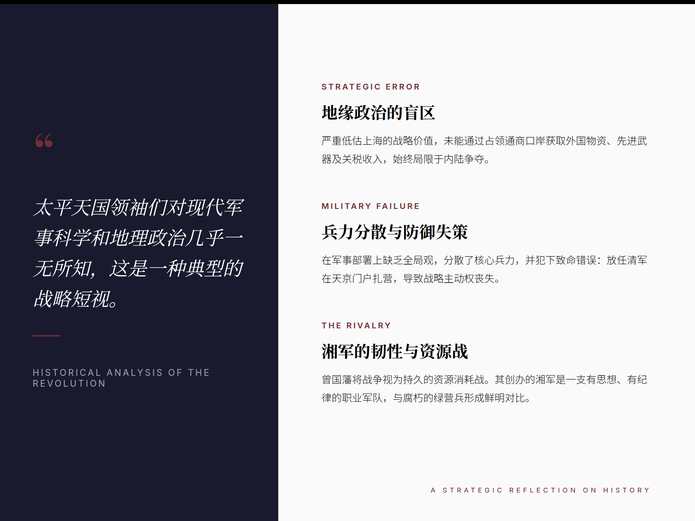
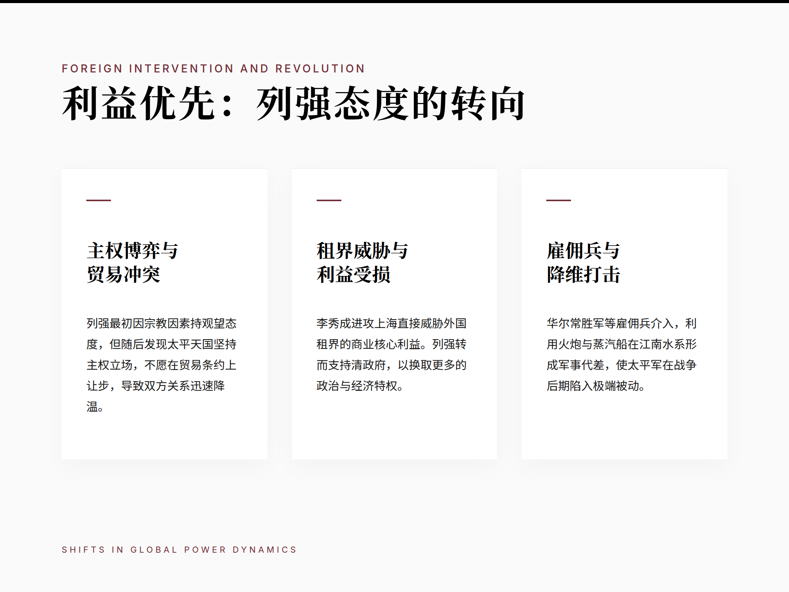
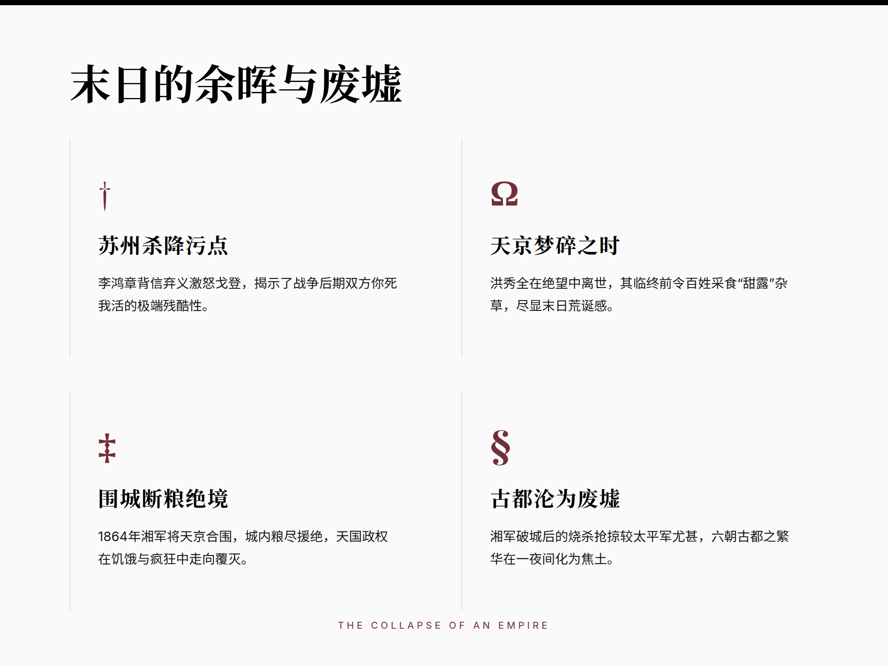
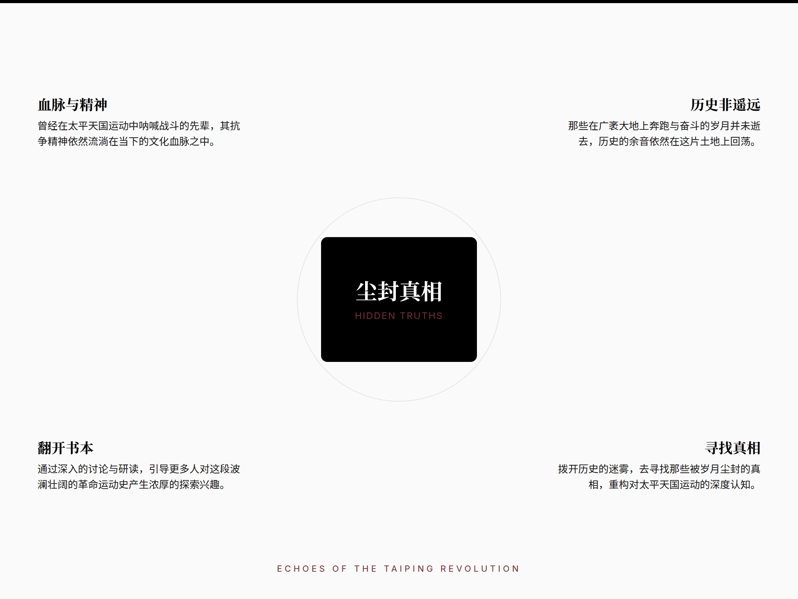
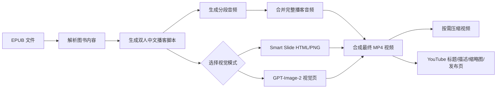

# epub2podcast

一个**可独立运行**的本地项目：把 EPUB 内容转换成双人中文播客脚本、音频、视觉页、最终 MP4 视频，并顺手生成 YouTube 发布素材。

> 当前版本：**v0.2.0**
>
> 发布定位：**可独立运行的早期 standalone 版本**

下载当前目录、安装依赖、配置 `.env` 后，就可以直接运行。

---

## 你能用它做什么

`epub2podcast` 当前最稳的工作流是：

- 读取 **EPUB** 文件
- 生成双人中文播客脚本
- 生成分段音频并合并为完整音频
- 生成 Smart Slide HTML/PNG，或使用 GPT-Image-2 生成更强视觉页
- 合成最终 MP4 视频
- 生成 YouTube 标题、description、缩略图 prompt 和静态发布页
- 按需压缩视频，便于上传或分享

如果你想把一本书快速整理成“可听、可看、可传播”的内容，这就是它最适合做的事。

---

## 适合谁

这个项目特别适合：

- 想把一本 EPUB 做成中文播客的人
- 想把文字内容进一步做成视频播客的人
- 想在本地掌控脚本、音频、页面和视频产出的人
- 想把“电子书 → 播客”做成可复用流程的人

---

## 示例效果

<table>
  <tr>
    <td width="50%" valign="top">
      
      <p><strong>YouTube 缩略图</strong><br/>GPT-Image-2 直接生成 3:2 原图，用于视频发布封面。</p>
    </td>
    <td width="50%" valign="top">
      
      <p><strong>信息图风格</strong><br/>适合展示结构化信息、核心观点或分层关系。</p>
    </td>
  </tr>
  <tr>
    <td width="50%" valign="top">
      
      <p><strong>左右分栏讲述页</strong><br/>适合做“左侧引言 + 右侧要点展开”的内容页，版式更有杂志感。</p>
    </td>
    <td width="50%" valign="top">
      
      <p><strong>三卡片信息页</strong><br/>适合把一个主题拆成 3 个并列重点，方便快速浏览与理解。</p>
    </td>
  </tr>
  <tr>
    <td width="50%" valign="top">
      
      <p><strong>条目列表版式</strong><br/>适合做学术总结、历史回响、观点归纳这类要点式内容页。</p>
    </td>
    <td width="50%" valign="top">
      
      <p><strong>中心聚焦版式</strong><br/>适合用一个核心概念带出四周支撑观点，展示主题与延展关系。</p>
    </td>
  </tr>
</table>

---

## 工作流程


```mermaid
flowchart LR
    A[EPUB 文件] --> B[解析图书内容]
    B --> C[生成双人中文播客脚本]
    C --> D[生成分段音频]
    D --> E[合并完整播客音频]
    C --> F{选择视觉模式}
    F --> G[Smart Slide HTML/PNG]
    F --> J[GPT-Image-2 视觉页]
    E --> H[合成最终 MP4 视频]
    G --> H
    J --> H
    H --> I[按需压缩视频]
    H --> K[YouTube 标题/描述/缩略图/发布页]
```

---

## 安装前准备

### 系统依赖

请先确认本机已安装：

- Node.js 20+
- npm
- `ffmpeg`
- `ffprobe`
- Chrome / Chromium

### 环境变量

你至少需要准备以下能力对应的密钥：

- 文本/HTML 生成：通常使用 `OPENROUTER_API_KEY`
- GPT-Image 视觉页/缩略图：`OPENAI_API_KEY` 或 `GPT_IMAGE_API_KEY`
- 中文 TTS：通常使用火山引擎（Volcengine）相关变量

项目里已经附带：

- `.env.example`

你可以复制它来开始配置。

---

## 快速开始

### 1. 安装依赖

```bash
cd epub2podcast
npm install
```

### 2. 配置环境变量

```bash
cp .env.example .env
```

然后按你的实际账号信息填写 `.env`。

### 3. 构建项目

```bash
npm run build
```

### 4. 运行主流程

```bash
node dist/cli/run.js --epub ./book.epub --output-dir ./deliveries
```

或者使用脚本入口：

```bash
bash scripts/epub2podcast_local_run.sh --epub ./book.epub --output-dir ./deliveries
```

---

## 常用命令

### 查看主命令帮助

```bash
node dist/cli/run.js --help
```

### 从 EPUB 生成完整交付物

```bash
node dist/cli/run.js --epub ./book.epub --output-dir ./deliveries
```

### 使用 GPT-Image-2 生成视觉页

```bash
node dist/cli/run.js \
  --epub ./book.epub \
  --output-dir ./deliveries \
  --visual-mode gpt-image-slide \
  --image-density segment \
  --resolution 1440x1080
```

### 对已有 delivery 重生 GPT-Image 视觉页

```bash
node dist/cli/generate-gpt-images.js \
  --delivery-dir ./deliveries/book-xxx \
  --recompose
```

### 生成 YouTube 发布交接页

```bash
python3 scripts/publish_podcast_site.py \
  --delivery-dir ./deliveries/book-xxx \
  --output-root ./published-podcasts
```

### 重生成某一页 slide

```bash
node dist/cli/regenerate-slide.js \
  --delivery-dir /path/to/delivery \
  --slide-index 0 \
  --recompose
```

### 压缩最终视频

```bash
node dist/cli/compress-video.js \
  --input /path/to/final_podcast.mp4 \
  --output /path/to/final_podcast_compressed.mp4
```

### 环境检查

```bash
npm run smoke-test
```

---

## 输出内容

一次成功运行后，输出目录中通常会包含：

- `source/`：输入书文件副本
- `audio_segments/`：分段音频
- `smart_slides/`：Slide PNG
- `smart_slides_html/`：Slide HTML
- `gpt_image_slides/`：GPT-Image 视觉页（使用该模式时）
- `full_podcast.mp3`：完整播客音频
- `final_podcast.mp4`：最终视频
- `metadata/marketing.json`：YouTube 标题、description、缩略图 prompt 等发布素材

---

## 当前状态

### 已验证

当前 standalone 版本已经完成过真实端到端验证，验证通过的链路包括：

- 主流程：EPUB → 脚本 → 音频 → Slide/GPT-Image 视觉页 → MP4
- GPT-Image 视觉页生成与重新合成
- YouTube 发布交接页生成
- 单页重生成：`regenerate-slide`
- 视频压缩：`compress-video`
- namespace 前缀 OPF 结构的 EPUB 解析兼容性（已用《太平天国革命运动史》样本验证）

### 当前最稳的输入类型

- **EPUB**

### 还会继续完善的方向

- 更完整的 PDF / MOBI / AZW3 支持
- 更少的历史依赖
- 更统一的 CLI 参数设计
- 更完善的错误提示和自动检查

---

## 常见问题

### 现在还需要原始 `epub2podcast-local` 项目吗？

**不需要。**

当前这个目录已经具备独立安装、独立构建和独立运行能力。

### 是不是下载后就能直接跑？

原则上是，但前提是：

- 系统依赖已安装
- `.env` 已配置
- 你使用的是当前最稳的输入路径（推荐 EPUB）

### 如果最终 MP4 太大怎么办？

可以直接运行：

```bash
node dist/cli/compress-video.js --input /path/to/final_podcast.mp4
```

### 如果只想重做某一页 slide，可以吗？

可以：

```bash
node dist/cli/regenerate-slide.js --delivery-dir /path/to/delivery --slide-index 0 --recompose
```

---

## 排查建议

### 找不到 `ffmpeg` / `ffprobe`

先检查：

```bash
ffmpeg -version
ffprobe -version
```

### `.env` 没配好

先重点检查：

- `OPENROUTER_API_KEY`
- `VOLCENGINE_ACCESS_TOKEN`
- `VOLCENGINE_APP_ID`
- `VOLCENGINE_VOICE_ID_MALE`
- `VOLCENGINE_VOICE_ID_FEMALE`

### Smart Slide 生成失败

优先检查：

- Chrome / Chromium 是否可用
- Puppeteer 是否安装正常
- 当前机器能否访问所需模型服务

---

## 目录结构

```text
epub2podcast/
├── README.md
├── SKILL.md
├── package.json
├── tsconfig.json
├── .env.example
├── assets/
├── scripts/
└── src/
```

其中：

- `src/`：独立运行所需源码
- `scripts/`：方便调用的 shell 入口
- `assets/`：README 示例图
- `examples/`：最小命令示例与环境配置示例

如果你想快速查看实际命令，可继续看：

- `examples/sample-commands.md`
- `examples/env-minimal-example.md`
