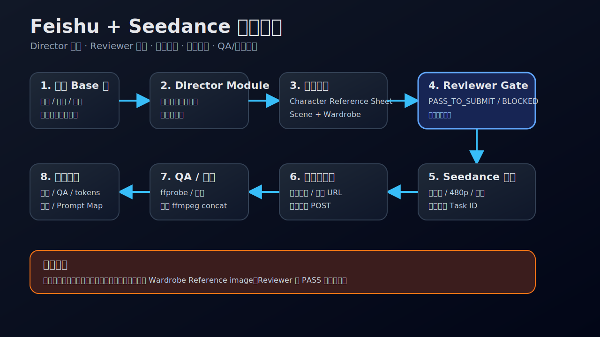

# Feishu + Seedance 视频产线

用飞书多维表格管理 Seedance 视频生产：资产、Prompt、payload、成片、QA、tokens、成本，全在一条可追溯链路里。

这不是单纯调用视频 API。它把“生成前补表”和“生成后回填”当成产线的一部分，避免烧完钱后找不到输入、Prompt、参考图和质量结论。



## 适合做什么

| 场景 | 结果 |
|---|---|
| 从飞书多维表第 N 行生成视频 | Prompt / Payload / Task ID / 成片 / QA 全回填 |
| 管理角色、场景、动作参考资产 | 每个资产有工具、Prompt、附件、URL 和用途说明 |
| 用 Seedance 2.0 Fast 控成本出片 | 默认 480p + Fast，生成后记录 tokens 和估算成本 |
| 把可看版本固化成 baseline | `Prompt_Output_Map` 记录完整输入输出链路 |
| 修复历史视频行 | 对齐 Prompt、payload、附件、QA、成本、Local Path |

## 核心流程

```text
飞书 Base 行
→ 读取字段和记录
→ 准备角色 / 场景 / 动作参考资产
→ 写 Row-24 式中文细导演稿
→ 生成 Seedance payload
→ 提交前补表并 record-get 复核
→ 用户确认后提交 Seedance
→ 轮询、下载、ffprobe、抽帧、转写
→ 回填成片、QA、tokens、成本、Prompt_Output_Map
→ 最终 record-get 验证
```

## 默认策略

- 默认模型：`doubao-seedance-2-0-fast-260128`
- 默认分辨率：`480p`
- 默认风格：邵氏电影质感 / 写实古风棚拍 / 武侠喜剧质感
- 默认 Prompt：中文完整版，逐秒时间轴必须带镜头语言
- 未经确认不提交 billable Seedance 任务
- 成功后必须报告 tokens 和估算成本

## Prompt 模板

这个 skill 不是只写“原则”，还带三份可直接套用的模板：

```text
templates/character-reference-sheet-prompt-template.md
templates/scene-environment-settings-prompt-template.md
templates/seedance-row24-director-template.md
```

对应三类物料：

- 主要角色 Character Reference Sheet
- Scene, Environment, and Settings reference image
- 驱动 Seedance 的第24行/第28行风格中文细导演稿

## Prompt 标准

一个合格的 Seedance Prompt 至少包含：

1. 片长、比例、分辨率、音频设置
2. 角色数量、身份、服装、站位锁定
3. 参考图按 `content[]` 顺序说明用途
4. 场景锚点和道具状态
5. 逐秒时间轴：每段都有构图、运镜/切换、动作、空间连续性、对白/音效
6. 限制项：无字幕、无气泡、无水印、无额外角色、无身份漂移

不要写 `@Image1`。Seedance API 的参考绑定靠 payload 里的 `content[]` 顺序和 `role`。

## 最小 payload

```json
{
  "model": "doubao-seedance-2-0-fast-260128",
  "duration": 12,
  "resolution": "480p",
  "ratio": "16:9",
  "generate_audio": true,
  "return_last_frame": false,
  "content": [
    {"type": "text", "text": "完整中文导演稿..."},
    {"type": "image_url", "image_url": {"url": "https://example.com/reference.png"}, "role": "reference_image"}
  ]
}
```

## 飞书多维表字段

字段名按项目会变，但常见信息包括：

```text
角色参考图工具 / Prompt / 附件 / URL
场景环境设定参考图工具 / Prompt / 附件 / URL
动作参考图或 Top-Down Blocking Map 工具 / Prompt / 附件
Prompt
Seedance视频_Prompt
Payload文件
Reference_URLs
Prompt_Output_Map
计划参数
Task ID
生成视频成片
质量检查抽帧图
QA摘要
Tokens
估算成本CNY
状态
```

原则：**字段先发现，再写入；写入后再回读。**

## 成本记录

Fast 常用估算口径：

- 无视频输入：约 37 元 / 1,000,000 tokens
- 有视频输入：约 22 元 / 1,000,000 tokens

生成完成后读取 `usage.total_tokens`，计算并回填。

## 安全规则

- 公开示例只用 `<BASE_TOKEN>`、`<TABLE_ID>`、`<RECORD_ID>` 占位符
- 不提交 API Key、访问令牌、签名 URL、`.env`、私有工作区 ID
- Git push 前扫 staged diff
- 不把 token 写进 Git remote URL

## 旧入口说明

此前拆开的两个入口已经归档：

- `seedance-video-local`：偏底层 API 调用
- `feishu-bitable-video-baseline-completion`：偏多维表 baseline 补全

现在统一使用本 skill。少一个入口，少一类误会。
