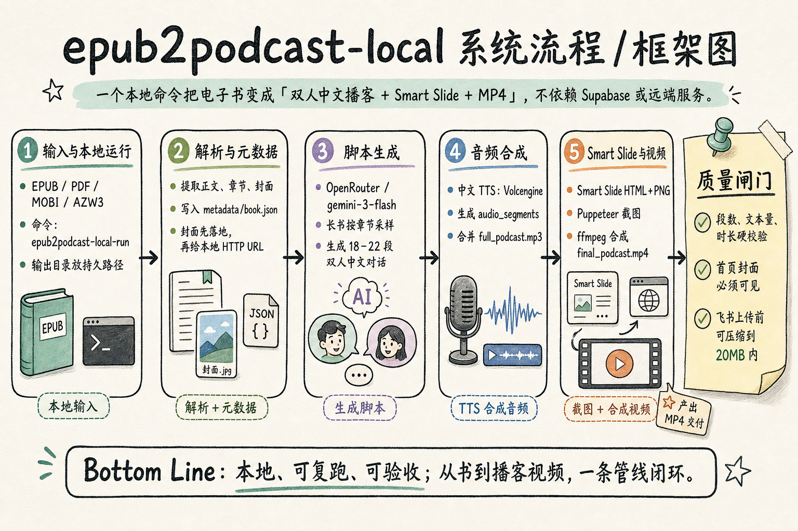

# gpt-image-2-handdrawn-diagram

把一段文字、架构说明、流程笔记，变成一张高可读性的手绘知识图解。

它适合做：

- 给 PM / 老板 / 客户看的技术框架图
- 把 Mermaid、draw.io、白板草图换成更温暖的传播图
- 把复杂 workflow 压成 30 秒能看懂的一页图
- 用 GPT-Image-2 生成手帐风、白板推演风、咨询报告风的信息图

模板来源：小小东的 GPT-Image-2 手绘架构图文章。主页：<https://x.com/xiaoxiaodong01>

---

## 示例

下面是用这个 skill 生成的 `epub2podcast-local` 系统流程图：



---

## 核心思路

这个 skill 的重点不是“画得可爱”。

它锁住三件事：

1. **顶部先给核心判断**：读者先知道这张图想说明什么。
2. **中部模块化阅读**：3–6 个模块，按流程、对比、阶段或因果排列。
3. **底部留一句结论**：让人看完后记住一句话。

视觉上使用：

- 浅米白 / 浅暖灰背景
- 黑色手写线条
- 圆角分区、编号、箭头、便签
- 低饱和青绿、鼠尾草绿、淡紫、柔橙、浅蓝

---

## 适合输入什么

推荐给模型的内容越结构化，出图越稳。

最小输入格式：

```markdown
主题：<图解主题>
读者：<谁会看这张图>
核心判断：<一句话 takeaway>
画布：16:9，中文，技术名词保留英文

阅读路径：从左到右，输入 → 解析 → 生成 → 渲染 → 交付

模块 1：<标题>
- <短 bullet>
- <短 bullet>
- <短 bullet>

模块 2：<标题>
- <短 bullet>
- <短 bullet>
- <短 bullet>

底部总结：<一句话 Bottom Line>
```

---

## 使用方式

在 Hermes Agent 里加载 skill：

```text
使用 gpt-image-2-handdrawn-diagram，把下面内容画成手绘知识图解：
...
```

然后由 Agent 组装 prompt，并调用 `image_generate`。

在这个 Hermes 环境中，`image_generate` 背后就是 GPT-Image-2。

---

## 注意事项

- 模块超过 8 个就拆成多张图。
- 技术名词别乱翻译：`OpenRouter`、`ffmpeg`、`Puppeteer` 这类保留英文。
- 小字越多越容易糊。宁可少写，也别塞满。
- 图标只是路标，文字才是主体。
- 架构图不能乱补组件；没给的信息就别编。

---

## 文件

- [`SKILL.md`](./SKILL.md)：Hermes skill 本体
- [`assets/example-epub2podcast-local.png`](./assets/example-epub2podcast-local.png)：示例图
