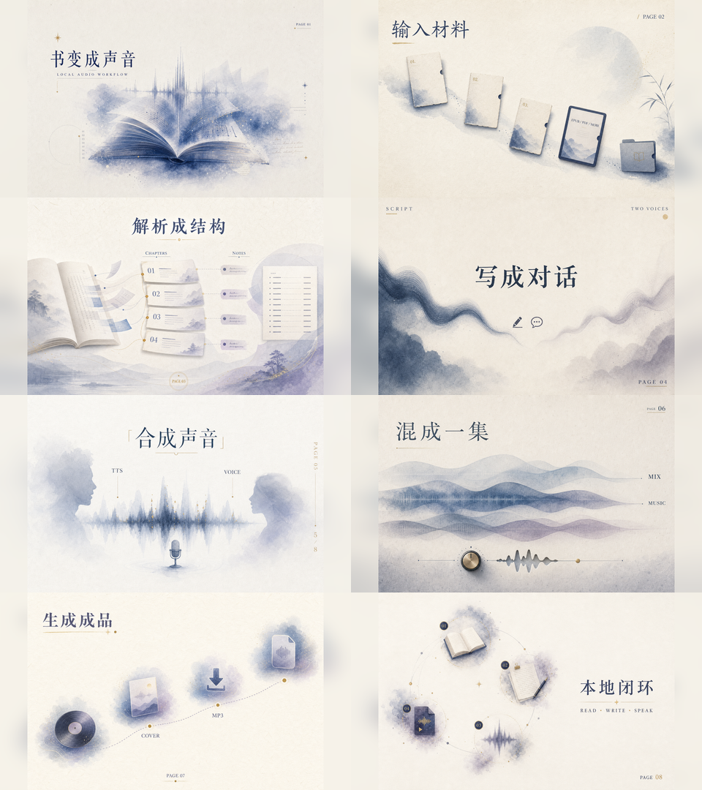
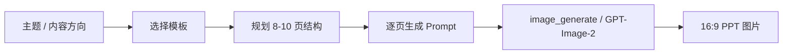
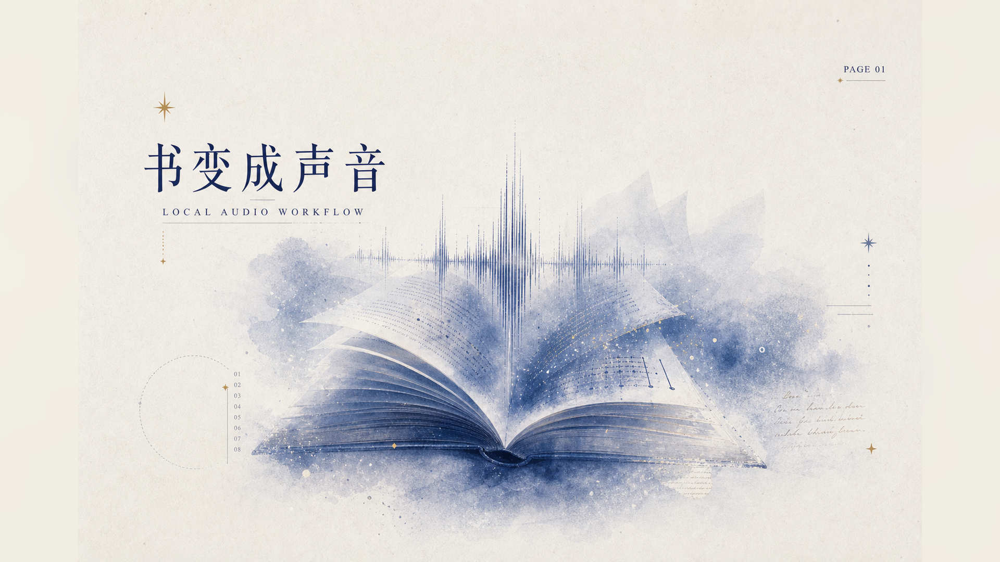
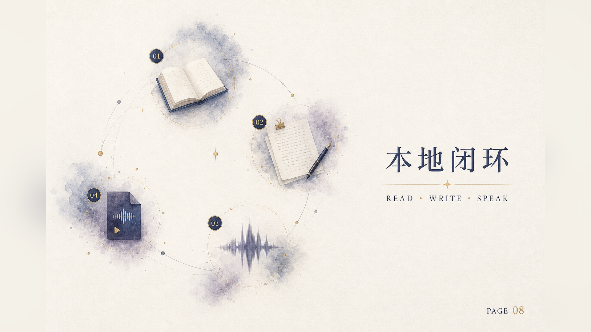

# GPT-Image-2 Paper PPT Images

用 GPT-Image-2 生成「PPT 式图片」的 Hermes skill。

它不是做可编辑 `.pptx` 的工具，而是把主题直接生成成一组可放进 PPT、文章、报告或社交平台里的高质感视觉页。



## 适合做什么

- PPT 封面、章节页、课程页
- 报告页、信息图、知识卡片
- 邀请函、社交封面、品牌故事页
- 茶、器物、建筑、人文、产品介绍等安静高级题材
- 3:4 小红书知识卡、文化海报、排行榜、暗色严肃主题页

## 四套 Prompt 模板

| 模板 | 风格 | 适合主题 |
|---|---|---|
| Template A — Paper Breath / Soft Nodes | 温白纸面、柔雾色团、轻颗粒、强留白 | 通用 PPT、课件、报告、封面、知识图 |
| Template B — Eastern Editorial / Booklet Page | 东方编辑感、米纸、淡墨、陈木、月洞/折扇/册页窗口 | 茶、手作、文化、人文、建筑、品牌故事 |
| Template C — Cropped Glyph / Oriental Grid | 巨大裁切汉字/数字/符号、极小注释、东方网格、朱印式强调色 | 3:4 小红书卡片、文化海报、信息图、排行榜、产品卡 |
| Template D — Dark Cropped Glyph / Serious Theme | 暗色纸面、裁切大字、暗红/铁灰/旧金、严肃报告气质 | 历史、政治、革命、严肃主题、暗色 PPT 示例 |

## 工作流



## 快速使用

在 Hermes 中加载 skill：

```text
使用 gpt-image-2-paper-ppt-images，帮我生成 8 张 PPT 风格图片。主题：一本书如何变成播客。
```

建议默认：

- PPT 默认 `aspect_ratio="landscape"`；小红书卡片 / 3:4 系列用 `aspect_ratio="portrait"`
- 一页一张图，不要把 10 页挤到一张图里
- 每页只放短标题、页码和 1-3 个短标签
- 需要准确长文本时，先生成背景图，再用 HTML/SVG/PPT 管线叠字

## 示例

### 封面页



### 收束页



## 来源与署名

Prompt 模板整理自小小东公开文章：

- Paper-breathing PPT / soft visual nodes：<https://x.com/xiaoxiaodong01/status/2056615926724976911>
- Eastern editorial PPT / booklet-page layouts：<https://x.com/xiaoxiaodong01/status/2056412276593410537>
- Cropped-glyph Eastern editorial PPT / light and dark variants：<https://x.com/xiaoxiaodong01/status/2057338307051508107>

本仓库只是把公开 prompt template 封装成 Hermes skill，方便复用；不代表原作者背书。

## 文件

- [`SKILL.md`](./SKILL.md)：完整 Hermes skill
- [`assets/`](./assets/)：示例图

## 常见坑

1. **一次生成十页会糊**：GPT-Image-2 单次出一张图更稳。
2. **字太多会变形**：可见文字越短越好。
3. **风格会跑商业海报**：Prompt 里要明确拒绝高饱和、塑料感、廉价模板。
4. **东方风容易变假古风**：Template B 已明确避开茶文化套壳、堆书法、廉价国风素材。
5. **巨大文字容易压死内容**：Template C/D 要让大字裁切出画面，小字做知识纹理，别把所有内容居中。
