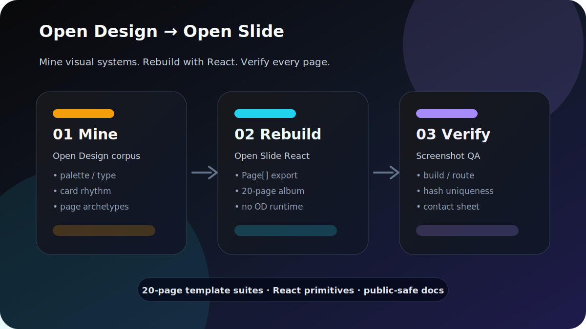

# open-design-to-open-slide



把 **Open-Slide 官方高质量模板** 和 **Open-Design 视觉风格库** 统一纳入一个模板生产工作流。

核心判断很简单：

> **Open-Slide 官方模板负责定质感，Open-Design 移植模板负责扩风格和场景。**

这不是把两个 runtime 混在一起。最终产物仍然是 Open Slide 的 React slides。

---

## 当前模板资产

| 分类 | 数量 | 页数 | 定位 |
|---|---:|---:|---|
| Open-Slide 官方 / Starter | **11 套** | **86 页** | 主质量基线，优先参考 |
| Open-Design 独立移植套件 | **38 套** | **760 页** | 风格扩展库，覆盖更多场景 |
| Open-Design 汇总 kit | **2 套** | - | 展示 / 索引 |
| 本地自制 demo | **3 套** | - | 实验 / 辅助 |

最干净的口径：

- **11 套 Open-Slide 官方基线模板**
- **38 套 Open-Design 移植模板**

---

## Open-Slide 官方模板清单

这些是视觉质量基线。做新模板、改 OD 模板、判断页面是否够“像样”，先看它们。

| Slug | 页数 | 适合参考什么 |
|---|---:|---|
| `getting-started` | 13 | starter 结构、基础 primitives |
| `open-slide-launch` | 7 | 产品发布叙事 |
| `open-slide-anatomy` | 1 | 单页结构解释 |
| `vercel-ai-sdk` | 8 | 技术产品讲解 |
| `ssh-explained` | 10 | 概念教学 |
| `material-design-2014` | 7 | 设计史、强视觉叙事 |
| `claude-code-intro` | 9 | 产品介绍、工作流表达 |
| `harness-engineering` | 8 | 工程产品叙事 |
| `llm-fundamentals` | 12 | 知识解释型 deck |
| `nextjs-ppr-cache` | 2 | 短技术对比 |
| `raycast-api` | 9 | API / 产品能力介绍 |

---

## Open-Design 移植模板

当前有 **38 套独立 OD suite**，每套 **20 页**，合计 **760 页**。

它们适合：

- 快速扩充风格方向
- 覆盖更多业务场景
- 给 agent 生成 deck 时提供可选外观
- 从 Open-Design 的视觉系统里沉淀 React slide primitives

它们不应该压过官方模板。OD 移植版的定位是“风格库”，不是最高审美标准。

---

## 20 页 OD suite 标准结构

| 页码 | 页面 |
|---|---|
| 01 | Cover |
| 02 | Agenda |
| 03 | Problem / Context |
| 04 | Framework |
| 05 | Content |
| 06 | Metrics / Data |
| 07 | Timeline / Roadmap |
| 08 | Diagram / Architecture |
| 09 | Closing / CTA |
| 10 | Section Divider |
| 11 | Quote / Key Insight |
| 12 | Comparison |
| 13 | Process / Workflow |
| 14 | Matrix / 2×2 |
| 15 | Table / Spec |
| 16 | Case Study |
| 17 | Checklist |
| 18 | Risks / Tradeoffs |
| 19 | FAQ / Appendix |
| 20 | Thank You / Contact |

---

## 这个 skill 解决什么

| 问题 | 做法 |
|---|---|
| Open-Design 有很多视觉模板，但不能直接当 Open Slide runtime 用 | 只提取视觉语言和页面 archetype |
| OD 移植模板数量多，但质感不稳定 | 用 Open-Slide 官方模板做质量基线 |
| 新增模板容易只换皮、不成体系 | 固定 20 页结构，先扩覆盖，再做少量精修 |
| 页面是否可用不好判断 | 必须截图、hash、空白检测、contact sheet |

---

## 工作流

### 1. 先选质量基线

优先从 Open-Slide 官方模板里选参考：

- 产品发布：`open-slide-launch`
- 技术解释：`vercel-ai-sdk` / `ssh-explained` / `llm-fundamentals`
- 产品工作流：`claude-code-intro` / `raycast-api`
- 强视觉叙事：`material-design-2014`

### 2. 再选 OD 风格方向

从 OD suite 里选一个视觉方向：

- paper / editorial
- dark technical
- product launch
- finance report
- docs page
- XHS / social carousel
- dashboard / brief
- SaaS / pricing / onboarding

### 3. 用 Open Slide 重写

只保留：

- palette
- typography
- cards
- layout rhythm
- diagrams
- page archetype

拒绝：

- Open Design runtime
- daemon / agent adapter
- 单文件 HTML 导航脚本
- 第三方品牌 logo / lockup

### 4. QA 后再交付

最低验收：

- `pnpm build` 通过
- 每个 route 可打开
- 每页截图
- 无白屏 / 空页
- 截图 hash 无异常重复
- contact sheet 可人工扫一眼

---

## 快速使用

完整规则看 [`SKILL.md`](./SKILL.md)。

最小流程：

```bash
# 1. 创建 Open Slide deck
mkdir -p slides/od-example-suite

# 2. 写 index.tsx，导出 Page[]
# export default [Cover, Agenda, ..., ThankYou]

# 3. 构建
pnpm build

# 4. 截图验收
chromium --headless=new --no-sandbox \
  --window-size=1920,1080 \
  --screenshot=/tmp/od-example.png \
  "http://127.0.0.1:5173/s/od-example-suite?p=1"
```

---

## 关键原则

1. **官方模板定质量。** OD 移植版先向官方模板看齐。
2. **Open Design 只当素材矿。** 不引入它的 runtime。
3. **React primitives 优先。** 不塞 HTML 大坨。
4. **先稳定，再扩展。** 不批量乱改 38 套。
5. **构建成功不等于能看。** 截图 QA 必做。

---

## 一句话

这套 skill 的目标不是“把 OD 搬过来”。

它的目标是：**以 Open-Slide 官方模板为审美基线，用 Open-Design 扩出一套更大的 React slide 模板库。**
