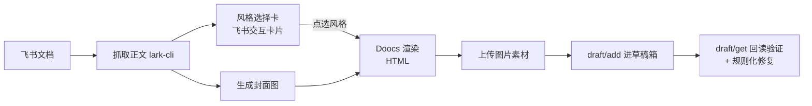

# wechat-publishing-workflow

飞书文档 → 微信公众号草稿箱的完整工作流 skill：从抽取、排版渲染、封面生成，到发布与发布后验证修复，一站式搞定。

适合谁：用飞书写稿、用公众号发文，并且不想每次手动调格式、传封面、查草稿的人。

## 亮点

- **一条命令到草稿箱**：飞书文档链接进去，公众号草稿出来，作者、封面、摘要、正文样式全自动。
- **交互卡片选风格**：发布前在飞书会话里收到一张风格选择卡（主题色 / 字号 / 字体 / 标题样式 / 代码主题 / 图注 / Mac 代码块），点一下即按所选风格发布；不操作则走默认风格。
- **封面完整生图**：封面（含标题文字）由图像模型一次性生成，2.35:1 导出，杜绝"背景图 + 代码贴字"的廉价感。
- **微信编辑器坑位全踩过**：代码块锁定宽度折行、长代码高度帽、飞书 grid 布局转 fixed 表格、外链转视觉 span、视频压缩后内嵌可播放 iframe……25+ 条实战规则内置在 SKILL.md。
- **发布后自动验证**：草稿回读校验标题 / 封面 / 图片数 / 样式残留 / 原文链接字段，不合格当场修复。

## 工作流程



## 前置条件

- 本仓库的 [`feishu-doc-to-wechat-draft/`](../feishu-doc-to-wechat-draft/) 项目（渲染与发布执行器，本 skill 是其上层工作流）。
- 微信公众号的 `appid` / `appsecret`（用于草稿 API）。
- 飞书自建应用 + [lark-cli](https://github.com/) 已登录（用于抓文档、发卡片、收卡片回调）。
- 卡片选风格功能需要：开发者后台 → 事件与回调 → **回调配置** → 添加「卡片回传交互 card.action.trigger」→ 长连接接收。
- Python 依赖：`lark-oapi`、`cryptography`。

## 快速开始

最小推送（默认风格：活力橙 / grace / 15px）：

```bash
python ../feishu-doc-to-wechat-draft/scripts/run.py publish-feishu-doc-default \
  --doc <飞书文档链接> --author <作者名> --cover-image /path/to/cover.png
```

带风格选择卡的完整流程见 `SKILL.md` 的「Interactive Style Selection Card」一节：

```bash
# 1. 生成风格选择卡
python scripts/style_select_card.py --token T001 --title "文章标题" \
  --doc-url <飞书链接> --output /tmp/card_T001.json

# 2. 发送卡片到飞书会话（feishu-card 或等价方式）

# 3. 后台等待用户点选，拿到 style.json
python scripts/wait_style_choice.py --token T001 --output /tmp/style_T001.json

# 4. 按所选风格发布
python ../feishu-doc-to-wechat-draft/scripts/run.py publish-feishu-doc-default \
  --doc <飞书文档链接> --style-json "$(cat /tmp/style_T001.json)" ...

# 5. 验证草稿
python scripts/verify_wechat_draft.py <draft_media_id>
```

## 目录说明

- `SKILL.md` — 给 AI agent 的完整工作流与 25+ 条实战规则。
- `scripts/style_select_card.py` — 从渲染器 `list-styles` 的 ui_schema 自动生成飞书风格选择卡。
- `scripts/wait_style_choice.py` — 长连接接收卡片回调，输出渲染器可用的 style JSON。
- `scripts/verify_wechat_draft.py` — 草稿回读体检（标题/封面/图片/样式/残留标记）。
- `references/` — 代码块对齐、视频内嵌、封面规则等 durable 技术档案，及被合并窄 skill 的原文档。

## 与同仓库其他目录的关系

本 skill 是伞形工作流，以下窄 skill 仍可单独使用：

- [`feishu-doc-to-wechat-draft/`](../feishu-doc-to-wechat-draft/) — 渲染 + 发布执行器（本 skill 的核心依赖）
- [`article-to-wechat-cover/`](../article-to-wechat-cover/) — 单独的封面生成
- [`wechat-article-camofox/`](../wechat-article-camofox/) / [`wechat-article-browseruse/`](../wechat-article-browseruse/) — 公众号文章反向抓取

## 常见问题

- **点了卡片没反应？** 确认回调加在「回调配置」Tab 而非「事件订阅」，且使用长连接接收。
- **草稿里中文乱码？** 微信 API 响应默认不带 charset，读响应必须显式 `decode('utf-8')`，详见 SKILL.md 规则 12b。
- **图片上传报 40137？** 超大尺寸 PNG 需先降采样，见 SKILL.md 规则 12c。
